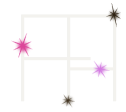
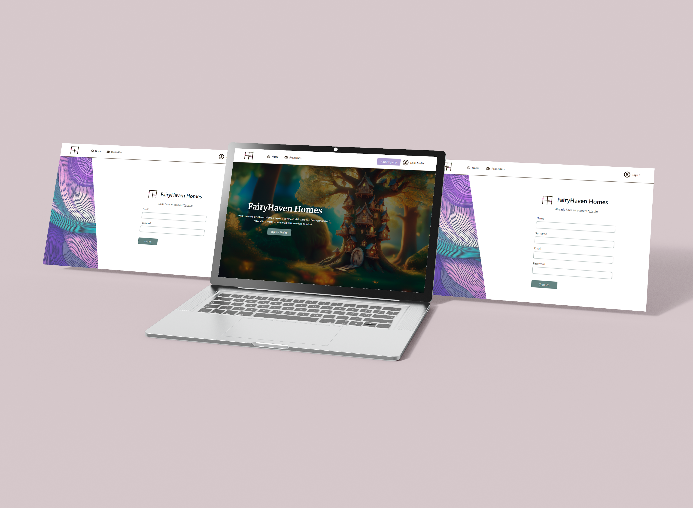
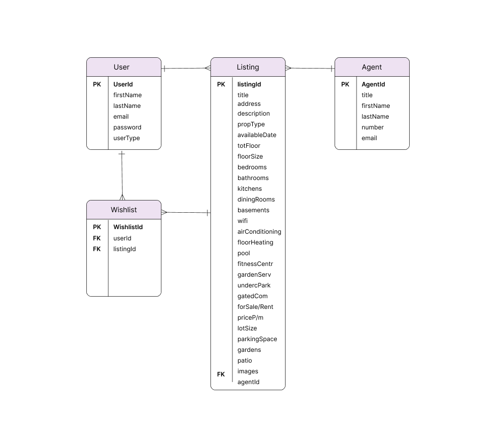

<!-- Repository Information & Links-->
 

<!-- HEADER SECTION -->
<h5 align="center" style="padding:0;margin:0;">Kayla Posthumus - 231096</h5>
<h6 align="center">DV200 Term 3</h6>
 

  
  
  <h3 align="center">Exhibito</h3>

  

     Where Art Meets Imagination 
      <a href="https://github.com/KaylaPosthumusOW/FairyHaven_Homes"><strong>Explore the docs »</strong></a>
    
    
   <a href="path/to/demonstration/video">View Demo</a>
    ·
    <a href="https://github.com/WolfOWI/exhibito/issues">Report Bug</a>
    ·
    <a href="https://github.com/WolfOWI/exhibito/issues">Request Feature</a>

<!-- TABLE OF CONTENTS -->
## Table of Contents

- [Table of Contents](#table-of-contents)
- [About the Project](#about-the-project)
  - [Project Description](#project-description)
  - [Built With](#built-with)
- [Getting Started](#getting-started)
  - [Prerequisites](#prerequisites)
  - [How to install](#how-to-install)
  - [Installation](#installation)
- [Features and Functionality](#features-and-functionality)
  - [Feature 1](#feature-1)
  - [Feature 2](#feature-2)
  - [Feature 3 - Standard User](#feature-3---standard-user)
  - [Feature 4 - Art House User](#feature-4---art-house-user)
  - [Feature 5 - Admin User](#feature-5---admin-user)
- [Concept Process](#concept-process)
  - [Ideation](#ideation)
  - [Wireframes](#wireframes)
  - [User-flow](#user-flow)
- [Development Process](#development-process)
  - [Implementation Process](#implementation-process)
    - [Highlights](#highlights)
    - [Challenges](#challenges)
  - [Future Implementation](#future-implementation)
- [Final Outcome](#final-outcome)
  - [Mockups](#mockups)
  - [Video Demonstration](#video-demonstration)
- [Roadmap](#roadmap)
- [Contributing](#contributing)
- [Authors](#authors)
- [License](#license)
- [Contact](#contact)
- [Acknowledgements](#acknowledgements)

<!--PROJECT DESCRIPTION-->

## About the Project

<!-- header image of project -->

### Project Description

FairyHaven Homes is a whimsical real estate platform that brings the magic of fairytales to life. Designed for those who dream of living in enchanted forests, flowery glades, or magical underwater coves, FairyHaven Homes provides a unique real estate experience where imagination meets reality. With a touch of fantasy, vibrant colors, and enchanting properties, this website caters to both young dreamers and adults seeking a bit of magic in their lives.

### Built With

- [HTML](https://developer.mozilla.org/en-US/docs/Glossary/HTML5)
- [CSS](https://developer.mozilla.org/en-US/docs/Web/CSS)
- [JavaScript](https://developer.mozilla.org/en-US/docs/Web/JavaScript)
- [Bootstrap](https://getbootstrap.com/)
- [PHP](https://www.php.net/)
- [MySQL](https://www.mysql.com/)
- [Apache](https://httpd.apache.org/)
- [phpMyAdmin](http://localhost/phpmyadmin/index.php?route=/database/structure&db=fairyhaven_homes)
- [JQuery](https://jquery.com/)
- [XAMMP](https://www.apachefriends.org/)

## Getting Started

The following instructions will get you a copy of the project up and running on your local machine for development and testing purposes.

### Prerequisites

Ensure that you have the latest version of [XAMMP](https://www.apachefriends.org/) installed on your machine for local development with PHP and MySQL.

### How to install

### Installation

Here are the steps to clone this repo using GitHub Desktop and set up the project:

1. **Clone the Repository**:

   - Open GitHub Desktop.
   - Click on `File` -> `Clone repository...`.
   - In the `URL` tab, enter `https://github.com/KaylaPosthumusOW/FairyHaven_Homes.git` and choose the local path where you want to save the repository.
   - Click `Clone`.

2. **Set Up Database and Environment for PHP**:

   - If using XAMPP or a similar environment, ensure Apache and MySQL services are running..
   - Open phpMyAdmin and create a new database for FairyHaven Homes.
   - Import the SQL schema provided in the database folder to set up the necessary tables.
  - Update the config.php file in the backend to include your database credentials.

3. **Access the Application**:

   - Open your web browser and go to `http://localhost/fairyhaven_homes/pages/signUp.php`.
   - You should see the Sign up form of Fairyhaven Homes.

By following these steps, you will have the FairyHaven Homes project up and running on your local machine. 

<!-- FEATURES AND FUNCTIONALITY-->
<!-- You can add the links to all of your imagery at the bottom of the file as references -->

## Features and Functionality

### Feature 1 - Sign in and Login

The Sign In/Login functionality enables users to authenticate themselves by providing their credentials—specifically, their email and password. Once authenticated, users can access their personalized dashboard, view saved properties, manage their listings, and interact with other features available to logged-in users.

## Standard User

### Feature 2 - Viewing and Adding Properties

The "View properties and adding Properties" feature is at the core of the FairyHaven Homes platform. It provides users with the ability to browse through a variety of enchanting properties available for rent or purchase and allows authorized users to add new properties to the listings. This feature is designed to deliver a magical and immersive user experience while ensuring ease of use and efficient property management.

### Feature 3 - Filtering Properties

The "Filtering Properties" feature enhances the user experience by allowing visitors to quickly and efficiently find properties that match their preferences. This functionality is essential for providing a streamlined and tailored browsing experience, especially given the variety of unique and magical properties available on FairyHaven Homes.

### Feature 4 - Profile page editing and wishlist

This feature enhances the user experience by allowing users to personalize their accounts and curate a list of favorite properties. This section provides an in-depth look at the functionality available on the profile page, focusing on how users can edit their personal information. The wishlist functionality allows users to keep track of properties they are interested in, providing a convenient way to revisit potential dream homes without having to search for them again.

## Admin User

### Feature 5 -Approve or Decline new properties

The "Approve or Decline New Properties" feature provides admins with the ability to moderate and manage property listings submitted by users. This feature ensures that only suitable and high-quality listings appear on the FairyHaven Homes platform, maintaining the site's integrity and user experience.

<!-- CONCEPT PROCESS -->
<!-- Briefly explain your concept ideation process -->

## Concept Process

The idea for FairyHaven Homes began with a creative vision to design a fantasy-themed real estate website where users can explore and find magical homes like treehouses, mushroom houses, flower dens, and underwater coves. The concept was developed around the idea of creating a fun, engaging, and visually captivating platform. The goal was to merge traditional real estate functionalities with imaginative storytelling elements.

### Ideation

For the ideation phase, I selected a color palette that captures the mystical essence of the project, combining soft, enchanting hues with vibrant, whimsical tones. Alongside this, I carefully chose typography that complements the fantasy theme, balancing readability with a touch of magic to enhance the overall feel of the platform.

### Wireframes

### ER Diagram

<!-- DEVELOPMENT PROCESS -->

Certainly! Here’s a filled-out version of the `Development Process` section:

---

## Development Process
The development process for FairyHaven Homes involves several stages to bring the magical real estate concept to life, combining frontend and backend development to provide a seamless, interactive experience for users.

### Implementation Process

**Functionality Implementations:**
- Implemented user authentication and authorization using PHP for secure login and access control.
- Developed CRUD operations for property listings, user profiles, and comments using PHP and MySQL.
- Built a responsive UI using HTML5, CSS3, and Bootstrap, ensuring accessibility across devices.
- Used JavaScript for client-side dynamic content updates and user interactions.

**Design Architecture:**
- Followed an MVC (Model-View-Controller) architecture for the backend to maintain a clear separation of concerns.
- Designed a modular frontend approach, using reusable components for forms, property cards, and modals to enhance maintainability and scalability.

**Plugins and Tools:**
- Utilized phpMyAdmin for managing MySQL databases, making it easy to handle database schemas, run queries, and perform backups.
- Integrated FontAwesome for icons and visual elements, enhancing the mystical theme of the platform.
- Used jQuery for simplified DOM manipulation and event handling to improve user interactions.

**Frontend Functionalities:**
- Developed user registration and login forms with validation to ensure data integrity.
- Created dynamic property listings that display detailed information, images, and amenities for each property.
- Built a user profile page where users can edit their information and view their wishlist.
- Implemented a filtering system that allows users to search for properties based on type, location, and features.
- Designed interactive modals for property inquiries, adding properties to the wishlist, and managing user accounts.

**Backend Functionalities:**
- Set up RESTful API endpoints using PHP for managing users, properties, and comments.
- Implemented server-side validation and error handling to ensure a robust and secure backend.
- Used environment variables for configuration settings and to manage sensitive data securely.
- Implemented admin functionalities for approving or declining new property listings and managing flagged comments.

#### Highlights

- Seeing the content from the backend populate on the front-end was very rewarding.
- Making the login and sign up functionality work.
- Creating a fun and enchanting website and playing around with ai generated images.

#### Challenges

<!-- stipulated the challenges you faced with the project and why you think you faced it or how you think you'll solve it (if not solved) -->

- Handling Asynchronous operations like API calls to get details of events, usernames or art houses proved difficult at times. 
- Designing a database schema to handle all the interactions between users, events, comments, art houses and tickets was a complex task.
- Ensuring that Exhibito was responsive at different screen sizes took a long time and was challenging.

### Future Implementation

<!-- stipulate functionality and improvements that can be implemented in the future. -->

- Adding more animations and interactivity.
- Having a more detailed admin dashboard with more functionality.
- 

<!-- MOCKUPS -->

## Final Outcome

### Mockups

<!-- VIDEO DEMONSTRATION -->

### Video Demonstration

To see a run through of the application, click below:

[View Demonstration](path/to/video/demonstration)

<!-- ROADMAP -->

## Roadmap

See the [open issues](https://github.com/KaylaPosthumusOW/FairyHaven_Homes/issues) for a list of proposed features (and known issues).

<!-- CONTRIBUTING -->

## Contributing

Contributions are what makes the open-source community such an amazing place to learn, inspire, and create. Any contributions you make are **greatly appreciated**.

1. Fork the Project
2. Create your Feature Branch (`git checkout -b feature/AmazingFeature`)
3. Commit your Changes (`git commit -m 'Add some AmazingFeature'`)
4. Push to the Branch (`git push origin feature/AmazingFeature`)
5. Open a Pull Request

<!-- AUTHORS -->

## Authors

- **Kayla Posthumus** - [KaylaPosthumusOW](https://github.com/KaylaPosthumusOW)

<!-- LICENSE -->

## License

Distributed under the MIT License. See `LICENSE` for more information.\

<!-- LICENSE -->

## Contact

- **Kayla Posthumus** - [231096@virtualwindow.co.za](mailto:231096@virtualwindow.co.za)
- **Project Link** - https://github.com/KaylaPosthumusOW/FairyHaven_Homes

<!-- ACKNOWLEDGEMENTS -->

## Acknowledgements

<!-- all resources that you used and Acknowledgements here -->

- [Pinterest](https://za.pinterest.com/kaylaposthu/dv200_t3/)
- [Figma](https://www.figma.com/design/JHGE9saJciFL4sHJmTFPkg/DV200_T3_FairyHaven-Homes?node-id=0-1&t=jfW3z9RIuaaeWvY2-1)
- [Bootstrap](https://getbootstrap.com/docs/5.3/getting-started/introduction/)
- [Lecturer](https://github.com/TsungaiKats)